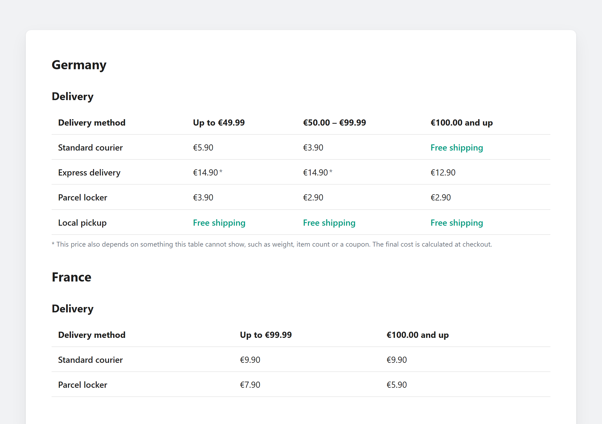
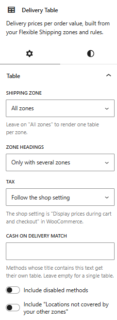
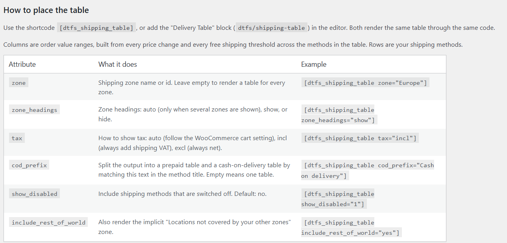
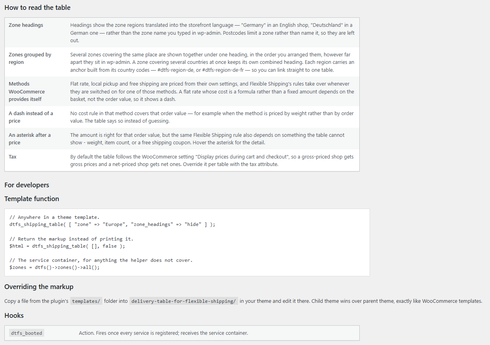

# Delivery Table for Flexible Shipping

Turns your [Flexible Shipping](https://wordpress.org/plugins/flexible-shipping/) zones and cost rules
into a delivery price table on the storefront. Order value ranges are the columns, your shipping
methods are the rows, and nothing is configured twice — change a rule in Flexible Shipping and the
table follows.

- **Author:** Marcin Siemieniuk-Morawski — <https://ms-m.pl/>
- **Requires:** WordPress 6.2, PHP 8.1, WooCommerce 7.0, Flexible Shipping by WP Desk
- **License:** GPL-2.0-or-later

---

## Screenshots

Two regions on one page. Order value ranges are the columns, shipping methods the rows; free
shipping is called free, and an asterisk marks a price that depends on more than the order value.

[](.wordpress-org/screenshot-1.png)

| The block | Placing the table |
| --- | --- |
| [](.wordpress-org/screenshot-2.png) | [](.wordpress-org/screenshot-3.png) |
| Zone, headings, tax and the cash-on-delivery split, in the block inspector. | Every shortcode attribute, documented under **WooCommerce → Delivery Table**. |

Reading the table, and the developer surface:

[](.wordpress-org/screenshot-4.png)

---

## Installation

1. Install and activate WooCommerce and Flexible Shipping.
2. Upload this plugin and activate it.
3. Drop `[dtfs_shipping_table]` on a page, or add the **Delivery Table** block.

**WooCommerce → Delivery Table** holds the full reference. There is nothing to configure there — the
plugin has no settings of its own on purpose.

---

## Shortcode

```
[dtfs_shipping_table]
```

| Attribute | What it does | Default |
| --- | --- | --- |
| `zone` | Shipping zone name or id. Empty renders one table per zone. | all zones |
| `zone_headings` | `auto` (only with several zones), `show`, `hide`. | `auto` |
| `tax` | `auto` (follow the WooCommerce cart setting), `incl`, `excl`. | `auto` |
| `cod_prefix` | Split into prepaid / cash-on-delivery tables by matching this text in the method title. | *(one table)* |
| `show_disabled` | Include disabled shipping methods. | `0` |
| `include_rest_of_world` | Also render the implicit "Locations not covered by your other zones" zone. | `no` |

```
[dtfs_shipping_table zone="Europe" zone_headings="hide"]
[dtfs_shipping_table cod_prefix="Cash on delivery"]
```

## Block

The **Delivery Table** block (`dtfs/shipping-table`) renders the same table through the same code,
with the zone, the heading mode and the cash-on-delivery split in the inspector.

---

## How the table behaves

**Columns** are the union of every price change and every free shipping threshold across the methods
shown, so rows stay aligned when two carriers change price at different amounts. Boundaries follow
the shop's currency precision, so a zero-decimal currency such as HUF reads correctly.

**Zone headings** show the zone's *regions* translated into the storefront language — "Germany" in an
English shop, "Deutschland" in a German one — rather than the zone name typed into wp-admin.
Postcodes limit a zone rather than name it, so they are left out.

**Zones are grouped by region.** Shops often split one country across several zones — a courier zone
and a narrower one for certain postcodes. "What does delivery to Germany cost?" is one question, so
those zones are gathered under one heading, in the order you arranged them, however far apart they
sit in wp-admin. A zone covering several countries at once keeps its own combined heading. Every
region carries an anchor built from its country codes, so `/delivery/#dtfs-region-de` links straight
to one table.

**WooCommerce's own methods are priced too.** Flat rate, local pickup and free shipping are read from
their own settings, and Flexible Shipping's rules take over whenever they are switched on for one of
those methods. A flat rate written as a formula such as `10 + (2 * [qty])` depends on the basket
rather than the order value, so it shows a dash rather than a number that would be wrong.

**A dash** means no cost rule in that method covers that order value, typically because the method is
priced by weight or item count. The table says so rather than guessing, and in particular never
prints "Free shipping" for a range it cannot price.

**An asterisk** means the amount is right for that order value, but the same Flexible Shipping rule
also depends on something the table cannot show - a weight or item-count condition, or a free
shipping coupon the customer must still hold. Hovering it explains which.

**Prices** follow the WooCommerce "Display prices during cart and checkout" setting by default, so a
gross-priced shop gets gross prices and a net-priced shop gets net ones. Override it per table with
`tax="incl"` or `tax="excl"`.

---

## PHP API

```php
// Anywhere in a theme template.
dtfs_shipping_table( [ 'zone' => 'Europe', 'zone_headings' => 'hide' ] );

// Return the markup instead of printing it.
$html = dtfs_shipping_table( [], false );

// The service container, for anything the helper does not cover.
$zones = dtfs()->zones()->all();
```

### Hooks

| Hook | Type | Purpose |
| --- | --- | --- |
| `dtfs_booted` | action | Fires once every service is registered; receives the container. |

### Template overrides

Copy a file from `templates/` into
`wp-content/themes/<your-theme>/delivery-table-for-flexible-shipping/` and edit it there. Child theme
wins over parent theme, exactly like WooCommerce templates. Only storefront markup lives in
`templates/`; the admin screen is deliberately not overridable.

---

## Development

```bash
npm install                  # once
npm run build                # build the block into build/
npm run start                # watch mode

composer install             # dev-only, for PHPCS
composer run lint
```

Regenerating translations after a string change:

```bash
wp i18n make-pot . languages/delivery-table-for-flexible-shipping.pot \
  --domain=delivery-table-for-flexible-shipping --exclude=node_modules,build,vendor
wp i18n make-json languages --no-purge
```

PHP has no build step: the plugin ships a small PSR-4 autoloader instead of a Composer `vendor/`
directory, which keeps it from colliding with other plugins on a shared install. Composer is used
only for coding standards and never ends up in the distributed ZIP.

### Layout

```
delivery-table-for-flexible-shipping.php  Header, constants, bootstrap
includes/
  Autoloader.php  Plugin.php  Container.php   Boot and wiring
  Contracts/       Registrable
  Support/         WooCommerce + Flexible Shipping guards
  Shipping/        Zones, methods, rules, thresholds, tax, prices
  Table/           Intervals, cells, rows, table assembly, renderer
  Shortcodes/      Shortcode base + the table shortcode
  Blocks/          Dynamic Gutenberg block
  Admin/           Documentation screen (views/ is not theme-overridable)
  Assets/          Stylesheet registration
  Rendering/       Storefront template loader
  Api/functions.php  Public procedural helpers
templates/table/   The only theme-overridable views
src/shipping-table/    Block editor source (JSX)
build/shipping-table/  Built block, committed
languages/         .pot, .po, .mo, block editor .json
```

---

## Related

The free shipping progress bar and the simplified cart shipping row that used to live here were
split out, so this plugin does one thing. They are being rebuilt as separate projects.
